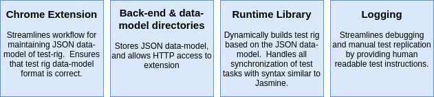
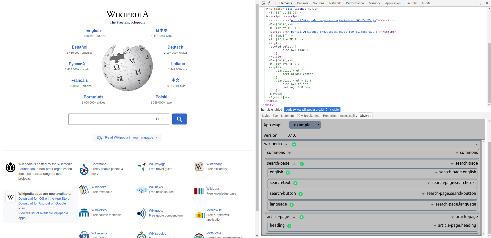
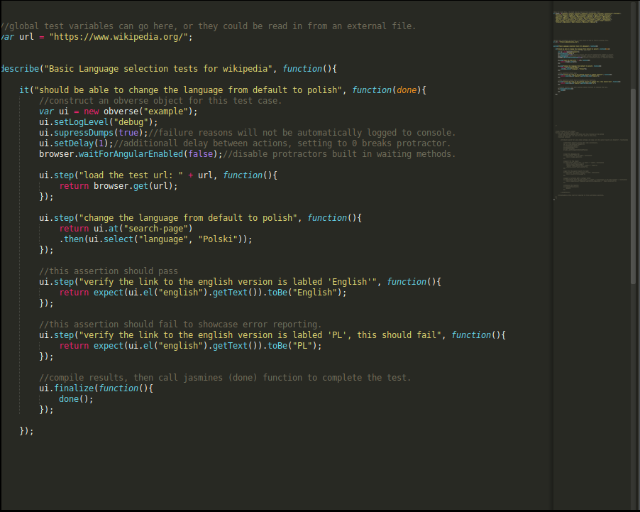
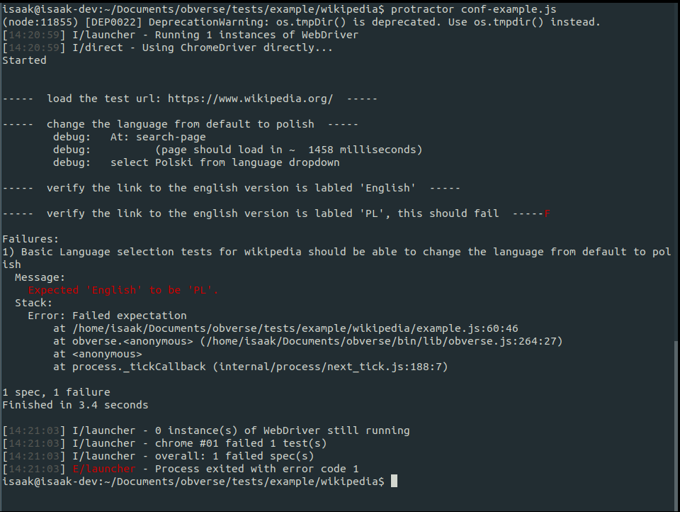

# Obverse

Obverse is a library and style guide for protractor automated testing, and is comprised of the following  parts:



The major additions to protractor are:

* Adds "step" function works similarly to jasmine "it" function, adding granularity to tests.
* Includes rich logging, debugging, and manual test-replication tools.
* Test rigs are built quickly using a data-entry tool which is added to chrome as an extension.

## Chrome Extension:

The most visible part of an obverse test is the "map" of the website to test. A chrome extension which adds a data-entry tool to the developer tools enables a fast developer workflow for creating and updating test-rigs.




## Back end & Directory Structure:

A back end written in Node.js allows the meta-data about the website to be stored to disk.  Tests are always stored in a consistent directory structure.  The tests directory stores all the test areas.  each of those directories contains a data-model folder, which contains the obverse test rigs, and a test-scripts directory which contains any tests or test data-sets.


## Test Library:

The Obverse run time library uses the data stored in the "data-model" directory to build test rigs on the fly at run time.  Below is an example of a test rig being created and used in a language test for Wikipedia:

* An Obverse object is created to be used for the test, and is concisely named "ui".
* Obverse objects allow test specific timing, logging, and debugging options.
* Obverse.step (ui.step) is used to denote actions which occur in a single browser state.
* Obverse.at (ui.at) is used to force a browser context check/wait.
* Obverse.el (ui.el) is used to locate a page element based on its name in the data-model and the current page location.
* Obverse.finalize (ui.finalize) compiles failure reasons and fails or passes the test.




Obverse also provides built in "shorthand" actions for the following browser actions:

* Clicking
* Typing into a field
* Drop-down selections
* Clearing a field


### Logging and Output:

Obverse provides in depth logging, and can be used to generate human readable instructions for failing tests.  Failing tests can have their instructions compiled and then sent automatically to manual QA personnel for a second check.  This saves developer time.




# Getting started:

### Pre-requisites:

* Node 8.xx
* Protractor installed and working
* Familiarity with Jasmine/Protractor/Node.js

### Setup

1. Download and unzip a stable version from the "releases" tab on this GitHub page.

1. Open chromes extension tools by going typing: ```chrome://extensions``` into the address bar.

1. Clicking ```load unpacked``` near the top.

1. Navigate to the the directory where you un-zipped the release, and then into: ```obverse/bin/ui```

1. Select "open"

1. The obverse plugin will now appear in your developer tools, but requires the back end to be running to function fully.

1. Navigate to: ```obverse/tests``` in the directory that was just unzipped.

1. Copy the ```demo``` directory, and name the copy to whatever you want the new test area to be called.

1. Open a terminal window and CD into the following directory: ```obverse/tests```

1. Run the command: ```node init.js``` to start the back end on your computer.

1. Open the developer tools in chrome (this must be done AFTER starting the back end), and select your new test area from the ```app-map``` drop down.

1. The copied obverse test area has all the boilerplate code you need to get started.  Refer to API documentation and the examples for more in depth guidance.