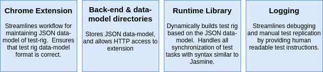
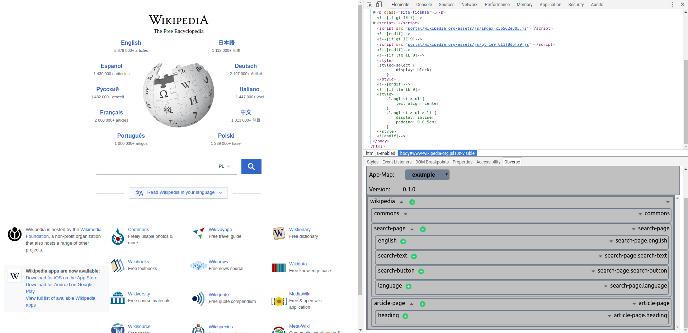
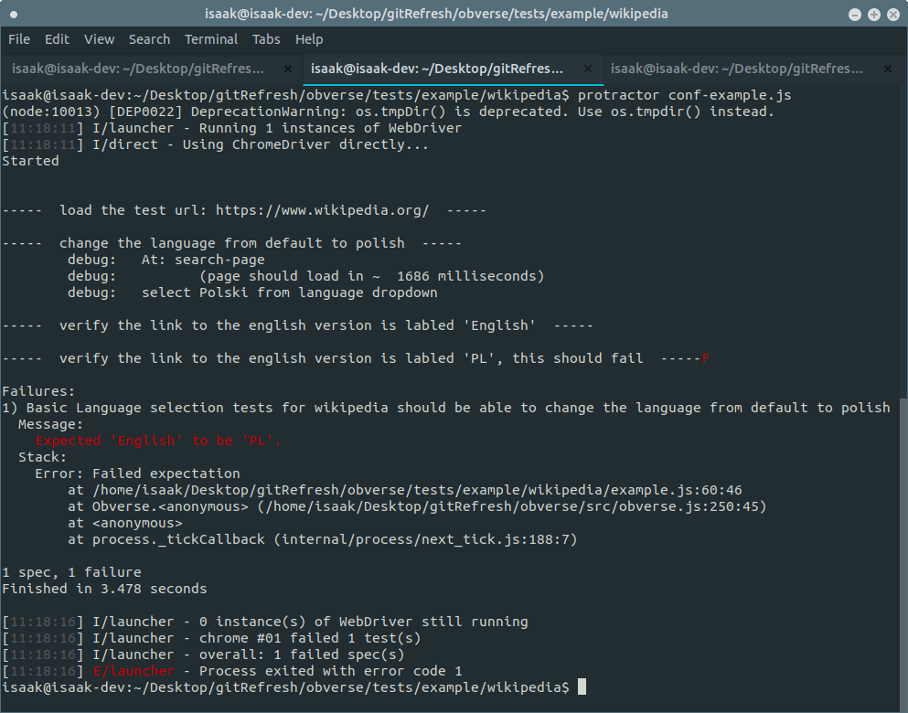

# Obverse

Obverse is a library and style guide for protractor automated testing, and is comprised of the following  parts:



The major additions to protractor are:

* Adds "step" function works similarly to jasmine "it" function, adding granularity to tests.
* Includes rich logging, debugging, and manual test-replication tools.
* Test rigs are built quickly using a data-entry tool which is added to chrome as an extension.

## Chrome Extension:

The most visible part of an obverse test is the "map" of the website to test. A chrome extension which adds a data-entry tool to the developer tools enables a fast developer workflow for creating and updating test-rigs.




## Test Rig Data:

Test rigs are stored in a rigid directory structure.  The entire directory is considered to be a part of the test rig, but there is no database or other complex data-store.

```
/data-model
  /images
  /app-map-backups
  app-map.json
  .gitignore
```

* The images folder stores image metadata about test elements.
* The app-map-backups directory contains a copy of app-map.json at every single save point
* app-map.json is the primary data used by the chrome extension to store test rig data
* .gitignore is included by default so that the large images and app-map-backup directories don't wind up in your repository!


## Test Library:

The Obverse run time library uses the data stored in the "data-model" directory to build test rigs on the fly at run time.  Below is an example of a test rig being created and used in a language test for Wikipedia:

* An Obverse object is created to be used for the test, and is concisely named "ui".
* Obverse objects allow test specific timing, logging, and debugging options.
* Obverse.step (ui.step) is used to denote actions which occur in a single browser state.
* Obverse.at (ui.at) is used to force a browser context check/wait.
* Obverse.el (ui.el) is used to locate a page element based on its name in the data-model and the current page location.
* Obverse.finalize (ui.finalize) compiles failure reasons and fails or passes the test.

```js
var Obverse = require('../../../src/obverse');
//global test variables can go here, or they could be read in from an external file.
var url = "https://www.wikipedia.org/";

describe("Basic Language selection tests for wikipedia", function(){

	it("should be able to change the language from default to polish", function(done){
		//construct an obverse object for this test case.
		var ui = new Obverse("example");
		ui.setLogLevel("debug");
		ui.suppressDumps(true);//failure reasons will not be automatically logged to console.
		ui.setDelay(1);//additionall delay between actions, setting to 0 breaks protractor.
		browser.waitForAngularEnabled(false);//disable protractors built in waiting methods.

		ui.step("load the test url: " + url, function(){
			return browser.get(url);
		});

		ui.step("change the language from default to polish", function(){
			return ui.at("search-page")
			.then(ui.select("language", "Polski"));
		});

		//this assertion should pass
		ui.step("verify the link to the english version is labled 'English'", function(){
			return expect(ui.el("english").getText()).toBe("English");
		});

		//this assertion should fail to showcase error reporting.
		ui.step("verify the link to the english version is labled 'PL', this should fail", function(){
			return expect(ui.el("english").getText()).toBe("PL");
		});

		//compile results, then call jasmines (done) function to complete the test.
		ui.finalize(function(){
			done();
		});

	});
});

```


Obverse also provides built in "shorthand" actions for the following browser actions:

* Clicking
* Typing into a field
* Drop-down selections
* Clearing a field


### Logging and Output:

Obverse provides in depth logging, and can be used to generate human readable instructions for failing tests.  Failing tests can have their instructions compiled and then sent automatically to manual QA personnel for a second check.  This saves developer time.




# Getting started:

### Pre-requisites:

* Node 8.xx
* Protractor installed and working
* Familiarity with Jasmine/Protractor/Node.js

### Setup

1. Download and unzip a stable version from the "releases" tab on this GitHub page.

1. Open chromes extension tools by going typing: ```chrome://extensions``` into the address bar.

1. Clicking ```load unpacked``` near the top.

1. Navigate to the the directory where you un-zipped the release, and then into: ```obverse/bin/ui```

1. Select "open"

1. The obverse plugin will now appear in your developer tools, but requires the back end to be running to function fully.

1. Navigate to: ```obverse/tests``` in the directory that was just unzipped.

1. Copy the ```demo``` directory, and name the copy to whatever you want the new test area to be called.

1. Open a terminal window and CD into the following directory: ```obverse/tests```

1. Run the command: ```node init.js``` to start the back end on your computer.

1. Open the developer tools in chrome (this must be done AFTER starting the back end), and select your new test area from the ```app-map``` drop down.

1. The copied obverse test area has all the boilerplate code you need to get started.  Refer to API documentation and the examples for more in depth guidance.